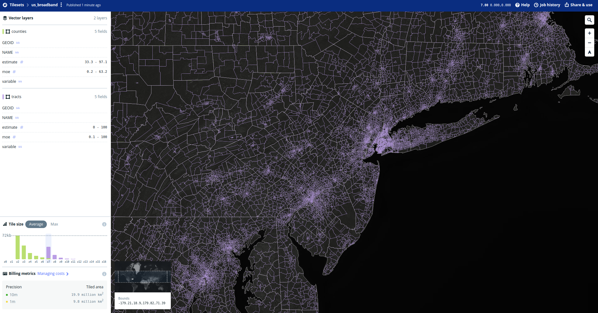

```{r setup, include=FALSE}
knitr::opts_chunk$set(echo = TRUE, warning = FALSE, eval = FALSE, out.width="100%")
options(tigris_use_cache = TRUE)
```

__mapboxapi__ version 0.5 added support for the [Mapbox Tiling Service (MTS) API](https://docs.mapbox.com/api/maps/mapbox-tiling-service/), Mapbox's recommended tool for publishing and maintaining vector tile data pipelines.  A major benefit to using R and __mapboxapi__ to interact with MTS is that data pipelines for web maps can be handled directly from R.  This vignette covers an example walkthrough of how to build dynamic web mapping applications with vector tiles using Mapbox Tiling Service and the [mapboxer R package](https://crazycapivara.github.io/mapboxer/), a flexible R interface to Mapbox GL JS.  

We'll be making a map of household access to a broadband internet subscription from the 2016-2020 American Community Survey that varies by zoom level.  The map should show county broadband internet access when zoomed out, and Census tract level information when zoomed in.  We will accomplish this by preparing a _multi-layer tileset_ that will store information for both aggregation levels.  

To get started, let's grab some data from the US Census Bureau using [tidycensus](https://walker-data.com/tidycensus/). This example assumes you have a Census API key; [review the tidycensus documentation to get set up if you don't](https://walker-data.com/tidycensus/articles/basic-usage.html).

```{r mts-get-data}
library(tidycensus)
library(mapboxapi)

county_broadband <- get_acs(
  geography = "county",
  variables = "DP02_0154P",
  year = 2020,
  geometry = TRUE
)

tract_broadband <- get_acs(
  geography = "tract",
  variables = "DP02_0154P",
  state = c(state.abb, "DC"),
  year = 2020,
  geometry = TRUE
)
```

## Publishing vector tiles from R with Mapbox Tiling Service

Spatial data prepared in R can be published to a user's Mapbox account with just a few steps.  These steps involve creating _tileset sources_, which are datasets stored as raw GeoJSON in a user's account; preparing a _tileset recipe_, which tells Mapbox how to create vector tiles from the GeoJSON sources; then creating and publishing _vector tilesets_.  These vector tilesets can be integrated directly into maps with Mapbox GL JS / the mapboxer R package, or added to Mapbox styles using Mapbox Studio.  

To create tileset sources directly from R, we using the function `mts_create_source()`.  We'll create a source for each dataset that we want to include in our tileset.  Assigning the results of `mts_create_source()` to an object allows us to capture the function's list output, which will be useful when building the tileset recipe.  

`mts_create_source()` requires a Mapbox access token with secret scope and write access to your Mapbox account. [Visit the Mapbox website](https://docs.mapbox.com/api/overview/#access-tokens-and-token-scopes) for more information about access tokens, and store yours using the `mb_access_token()` function.  You'll also supply your own username to the `username` argument, rather than use mine. Large datasets can take a few minutes to upload to your account depending on your connection speed.  

```{r}
county_source <- mts_create_source(
  data = county_broadband,
  tileset_id = "county_broadband",
  username = "kwalkertcu"
)

tract_source <- mts_create_source(
  data = tract_broadband,
  tileset_id = "tract_broadband",
  username = "kwalkertcu"
)
```

If the upload has succeeded, you'll get a message like this:

```
✔ Successfully created tileset source with the ID
'mapbox://tileset-source/kwalkertcu/tract_broadband'.
Use your source ID to build your tileset's recipe.
```

The tileset ID is also stored in the `id` element of the returned list.  If your request has failed, you should get an error message telling you why.  

You'll now use these tileset IDs to prepare a _recipe_.  MTS recipes are JSON documents that translate tileset sources to vector tiles.  [Preparing a recipe using the MTS documentation can be complicated](https://docs.mapbox.com/mapbox-tiling-service/reference/) as there are many options, but mapboxapi tries to simplify this process a bit:

- `mts_make_recipe()` is the general "recipe creation" function that takes one or more _recipe layers_ and formats their configuration appropriately for the MTS API. 
- Recipe layers can be prepared as an R list by hand, or preferably with the `recipe_layer()` function which helps users understand the range of options available.  Feature- and tile- specific options are available in `feature_options()` and `tile_options()`, respectively.  
- Some translation of the JSON examples provided by Mapbox and R's notation will be necessary.  When reading through the MTS documentation, remember the following: 
  - A _named list_ will be translated to a JSON object (curly braces); 
  - An _unnamed list_ will be translated to a JSON array (square brackets).  
  
Our recipe will include two layers (counties and tracts).  A recipe layer requires a tileset source ID, a minimum zoom level (`minzoom`), and maximum zoom level (`maxzoom`).

```{r}
broadband_recipe <- mts_make_recipe(
  counties = recipe_layer(
    source = county_source$id,
    minzoom = 2,
    maxzoom = 7
  ),
  tracts = recipe_layer(
    source = tract_source$id,
    minzoom = 7,
    maxzoom = 12,
    tiles = tile_options(
      layer_size = 2500
    )
  )
)
```

Our recipe is relatively simple, as MTS recipes are concerned; we include the required arguments (though layers can be viewed beyond the maximum zoom level with overzooming) as well as directions to max out the layer size for our tracts, ensuring that we can see as many tracts as possible when zoomed out.  

After preparing an MTS recipe, it can be passed to the `mts_validate_recipe()` function to make sure that it is formatted correctly.  

```{r}
mts_validate_recipe(broadband_recipe)
```

We get the message `✔ Your tileset recipe is valid!`; the function also returns `TRUE` or `FALSE` so you can do error handling in tileset creation pipelines if you wish.  

Just two more steps are required to publish the new tileset.  We create the tileset with `mts_create_tileset()`:

```{r}
mts_create_tileset(
  tileset_name = "us_broadband",
  username = "kwalkertcu",
  recipe = broadband_recipe
)
```

An empty tileset will be created in our Mapbox account.  To populate the tileset, publish it with `mts_publish_tileset()`

```{r}
mts_publish_tileset(
  tileset_name = "us_broadband",
  username = "kwalkertcu"
)
```

To check on the status of your tileset, you can head over to your Mapbox account and find your tileset on the __Tilesets__ tab.  Once the tileset is published, you'll be able to browse your tileset and review its recipe.  

```{r, echo = FALSE, eval = TRUE}

```

## Using vector tilesets in R with the mapboxer package

The [mapboxer R package](https://crazycapivara.github.io/mapboxer/) by Stefan Kuethe is a a flexible R interface to [Mapbox GL JS](https://docs.mapbox.com/mapbox-gl-js/api/), Mapbox's JavaScript web mapping library with a massive amount of features.  mapboxapi and mapboxer work quite nicely together; mapboxapi can handle the creation and maintenance of vector tileset pipelines, and mapboxer then handles the visualization of those tiles.  

The `add_layer()` function in mapboxer allows users to load remote vector tile layers from their Mapbox account and visualize them seamlessly in R.  Given that we've already tiled our county and tract data, we can visualize all 3000+ US counties and all 80,000+ Census tracts intelligently on the same map.  

The code used below (click "Show code" to view it) uses mapboxer to visualize counties and Census tracts in a scale-dependent manner.  At small zooms (below 7), counties will display; at larger zooms (7 and up), the view will switch over to Census tracts.  

<details><summary>Show code</summary>

```{r, class.source = "fold-hide"}
library(mapboxer)

broadband <- mapbox_source(
  type = "vector",
  url = "mapbox://kwalkertcu.us_broadband"
)

mapboxer(zoom = 3, style = basemaps$Mapbox$light_v10,
         center = c(-96, 37.5)) %>%
  add_layer(style = list(
    id = "county",
    type = "fill",
    source = broadband,
    "source-layer" = "counties",
    paint = list(
      "fill-color" = "blue",
      "fill-opacity" = 0.8
      ),
    maxzoom = 7
    ))  %>%
  add_layer(style = list(
    id = "tracts",
    type = "fill",
    source = broadband,
    "source-layer" = "tracts",
    paint = list(
      "fill-color" = "red",
      "fill-opacity" = 0.8
      ),
    minzoom = 7
  ))
```

</details>

<iframe src=img/dynamic_map.html width="100%" height="500px" scrolling="no"></iframe>

### Styling vector tiles with Mapbox GL JS and mapboxer

Mapbox GL JS has many, many more options available for users to customize styling of their vector tiles.  [While those options are voluminous](https://docs.mapbox.com/mapbox-gl-js/style-spec/), mapboxer can flexibly accommodate most options within the `add_layer()` function.  Similar to how recipes are specified in Mapbox Tiling Service, Mapbox style specifications can be readily translated to R by using named lists for objects and unnamed lists for arrays.  

The example below modifies the map using the following options:

- An Albers projection appropriate for the United States is used instead of the default Mercator projection.  (As of this writing (14 September 2022), this option is only available in a fork of the package, PR #104).  
- Counties and Census tracts are styled using linear interpolation inspired by the ColorBrewer YlGnBU palette. 
- For Census tracts, the `"case"` option is used for `NA` values to make tracts missing data mostly transparent.  

<details><summary>Show code</summary>

```{r, class.source = "fold-hide"}
# remotes::install_github("crazycapivara/mapboxer#104")
library(mapboxer)
mapboxer_use_v2(TRUE)

broadband <- mapbox_source(
  type = "vector",
  url = "mapbox://kwalkertcu.us_broadband"
)

broadband_map <- mapboxer(zoom = 3, style = basemaps$Mapbox$light_v10,
         center = c(-96, 37.5),
         projection = list(
           name = "albers",
           center = c(-96, 37.5),
           parallels = c(29.5, 45.5)
         )) %>%
  add_layer(style = list(
    id = "county",
    type = "fill",
    source = broadband,
    "source-layer" = "counties",
    paint = list(
      "fill-color" = list(
        "interpolate",
        list("linear"),
        list("get", "estimate"),
        33,
        '#edf8b1',
        65,
        '#7fcdbb',
        97,
        '#2c7fb8'
      ),
      "fill-opacity" = 0.8
    ),
    maxzoom = 7
  ),
  popup = "{{NAME}}<br/>Estimate: {{estimate}}%")  %>%
  add_layer(style = list(
    id = "tracts",
    type = "fill",
    source = broadband,
    "source-layer" = "tracts",
    paint = list(
      "fill-color" = list(
        "interpolate",
        list("linear"),
        list("get", "estimate"),
        33,
        '#edf8b1',
        65,
        '#7fcdbb',
        97,
        '#2c7fb8'
      ),
      "fill-opacity" = list(
        "case",
        list("==", list("get", "estimate"), NA),
        0.1,
        0.8
      )
    ),
    minzoom = 7
  ),
  popup = "{{NAME}}<br/>Estimate: {{estimate}}%")
```

</details>

<iframe src=img/styled_map.html width="100%" height="500px" scrolling="no"></iframe>


### Adding a custom-built legend

While mapboxer does not yet have official support for legends, the beauty of htmlwidgets is that you can customize your HTML output with some extra HTML and CSS.  I've built a custom legend to be placed over the map [by modifying a legend example from the Mapbox documentation](https://docs.mapbox.com/help/tutorials/show-changes-over-time/) and adding it to my mapboxer map with `htmlwidgets::prependContent()` and `htmlwidgets::appendContent()`.  

<details><summary>Show code</summary>

```{r, class.source = "fold-hide"}
style <- htmltools::HTML(
  "
  <style>
    @import url('https://fonts.googleapis.com/css2?family=Roboto&display=swap');

    h2 {
    font-size: 14px;
    font-family: 'Roboto';
    line-height: 20px;
    margin-bottom: 10px;
    }

    #legend {
    position: fixed;
    border-radius: 10px;
    top:10px;
    left:10px;
    margin: 10px;
    width: 120px;
    background-color: #ffffff80;
    padding: 10px 20px;
    z-index: 1002;
    }

    .content {
    margin-bottom: 20px;
    }

    .row {
    height: 12px;
    width: 100%;
    }

    .colors {
    background: linear-gradient(
    to right,
    #edf8b1,
    #7fcdbb,
    #2c7fb8
    );
    margin-bottom: 5px;
    }

    .label {
    width: 30%;
    display: inline-block;
    text-align: center;
    font-family: 'Roboto';
    }
    </style>
  "
)

legend <- htmltools::HTML(
  '
<div id="legend">
<div class="content">
<h2>Households with broadband access</h2>
<div class="row colors"></div>
<div class="row labels">
<div class="label">33%</div>
<div class="label">65%</div>
<div class="label">97%</div>
</div>
</div>
  '
)

broadband_map %>%
  htmlwidgets::prependContent(style) %>%
  htmlwidgets::appendContent(legend)

```

</details>

<iframe src=img/map_with_legend.html width="100%" height="500px" scrolling="no"></iframe>
