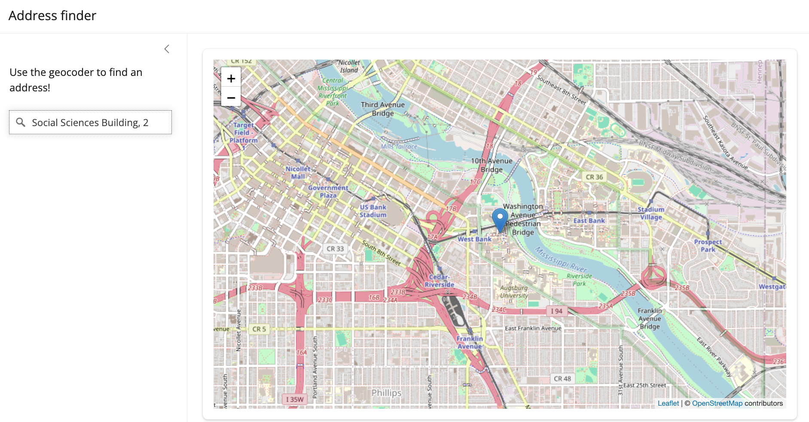

```{r setup, include=FALSE}
knitr::opts_chunk$set(echo = TRUE, warning = FALSE)
```

## Geocoding with Mapbox

A core skill for analysts practicing location intelligence is *geocoding*. Geocoding refers to the conversion of a *description of a place* to geographic coordinates - typically longitude (X) and latitude (Y). The most common place description that we use is an address, which will vary in form around the world.

mapboxapi offers an interface to [Mapbox's brand-new v6 Geocoder](https://docs.mapbox.com/api/search/geocoding/) as of package version 0.6. Let's explore some of its features.

Basic address geocoding, or *forward geocoding*, is implemented with the `mb_geocode()` function. `mb_geocode()` accepts a description of a place, then returns a length-2 vector of XY coordinates representing the location of that place. Let's try it out.

```{r}
library(mapboxapi)

mb_geocode("445 5th Ave, New York NY 10016")
```

`mb_geocode()` also accepts *structured input* as an R list, which is useful when you want to clearly specify components of an address. Here's an example of how that works:

```{r}
mb_geocode(
  structured_input = list(
    address_line1 = "445 5th Ave",
    place = "New York",
    region = "NY",
    postcode = "10016"
  )
)
```

`mb_geocode()` can also return a *simple features object* with the option `output = "sf"` . Simple features (sf) objects, from the **sf** R package, are the primary way that vector (points, lines, and polygons) spatial data are represented in R. mapboxapi is tightly integrated with the sf package, and you'll gain experience working with sf objects in this workshop.

Let's assign the result of `mb_geocode()` to a variable, then map it interactively with Mapbox GL JS via the **mapgl** R package..

```{r}
library(mapgl)

office <- mb_geocode("445 5th Ave, New York NY 10016", output = "sf")

mapboxgl(center = c(office$longitude, office$latitude), zoom = 15) |> 
  add_markers(office, popup = "full_address")
```

Mapbox also offers *reverse geocoding*, which takes XY coordinates and attempts to convert those coordinates into a description of a place (like an address) at that location. Reverse geocoding is available in mapboxapi with the `mb_reverse_geocode()` function.

```{r}
mb_reverse_geocode(c(-73.98188, 40.75162))
```

### Workflow: batch geocoding

One-off geocoding as illustrated above is very useful in targeted analyses and when building apps (you'll see how this works next week). For larger analyses, however, you'll want to geocode addresses in bulk. This process is called *batch geocoding*.

Batch geocoding typically involves sending a table of addresses to a geocoding service and getting back XY coordinates for all of those addresses. With v6 of its geocoder, Mapbox opened up batch geocoding to all users, which is now implemented in the latest release of mapboxapi.

Let's try it out with a real-world dataset. We'll be working with a dataset of Adult Residential Care facilities in the state of California, [obtained from the State of California Open Data portal](https://sandbox.data.ca.gov/dataset/community-care-licensing-adult-residential-facility-locations/c05efa69-8a1f-457e-8a34-9070c664bae6). You can find this dataset in mapboxapi's GitHub repository in `vignettes/data`.

We'll read in the dataset with the `read_csv()` function, [available in the **tidyverse** suite of tools](https://www.tidyverse.org/). If you haven't worked with the tidyverse before, it offers an integrated collection of packages that make your life much easier when working with data.

```{r, message = FALSE}
library(tidyverse)

ca_care <- read_csv("data/community-care-licensing-adult-residential-facility-locations.csv")

ca_care
```

We notice that the dataset has over 25,000 rows. It is a perfect candidate for geocoding, as it describes the locations of each adult care facility but doesn't include longitude and latitude, so it can't currently be mapped. While we *could* geocode all of these facilities - Mapbox's free tier offers 100,000 free geocodes per month - this isn't necessary. Let's instead clean up the dataset and filter down to a specific county - Ventura County to the west of Los Angeles.

```{r}
library(janitor)

ventura_care <- read_csv("data/community-care-licensing-adult-residential-facility-locations.csv") |> 
  clean_names() |> 
  filter(facility_status == "Licensed", county_name == "VENTURA")

ventura_care
```

Our dataset represents all currently licensed adult care facilities in Ventura County, which number 118.

The data are ready to be passed to `mb_batch_geocode()`. `mb_batch_geocode()` can take a single column, `search_column`, which contains full addresses. In this case, the address is split across multiple columns, which we can map to their corresponding arguments in the function.

```{r}
ventura_care_sf <- ventura_care |> 
  mb_batch_geocode(
    address_line1 = "facility_address",
    place = "facility_city",
    region = "facility_state",
    postcode = "facility_zip"
  )

ventura_care_sf
```

A *simple features* object of geometry type POINT is returned. `mb_batch_geocode()` tries to make geocoding as simple as possible for you: table of addresses in, sf object out ready for mapping and analysis. We note that new `accuracy` and `confidence` columns are returned in the output object. `accuracy` gives you information about the type of geocode [(see the Mapbox documentation for explanations)](https://docs.mapbox.com/api/search/geocoding/#point-accuracy-for-address-features) and `confidence` gives you the level of confidence Mapbox has in the geocoding result, ranging from "exact" to "low".

Let's map our geocoded results with clustered circles using the **mapgl** package.

```{r}
mapboxgl(bounds = ventura_care_sf) |> 
  add_circle_layer(
    id = "care",
    source = ventura_care_sf,
    circle_color = "blue",
    circle_stroke_color = "white",
    circle_stroke_width = 2,
    cluster_options = cluster_options(
      count_stops = c(0, 25, 50)
    ),
    tooltip = "facility_name"
  )
```

## Using Mapbox's geocoder in Shiny

**mapboxapi** also helps you build Mapbox's geocoder into your Shiny apps. The `mapboxGeocoderInput()` function allows you to use the Mapbox geocoder as a Shiny input. The geocoding result is captured as the value of the named input (e.g. `input$geocode`), which can be passed downstream to your analyses or maps in your Shiny app. The package also includes two functions to help you convert the geocoder's result into a usable output: `geocoder_as_xy()`, which converts to a length-2 vector of longitude and latitude coordinates; and `geocoder_as_sf()`, which converts the result to an sf POINT object.

Here's a minimal example of how to use `mapboxGeocoderInput()` in a Shiny app with the Leaflet package. The code follows below the image - try it out!



``` r
library(shiny)
library(bslib)
library(leaflet)
library(mapboxapi)

ui <- page_sidebar(
  title = "Address finder",
  sidebar = sidebar(
    p("Use the geocoder to find an address!"),
    mapboxGeocoderInput("geocoder",
                        placeholder = "Search for an address"),
    width = 300
  ), 
  card(
    leafletOutput("map")
  )
)

server <- function(input, output) {
  output$map <- renderLeaflet({
    leaflet() |> 
      addProviderTiles(provider = providers$OpenStreetMap) |> 
      setView(lng = -96.805,
              lat = 32.793,
              zoom = 12)
  })

  observe({
    xy <- geocoder_as_xy(input$geocoder)
    
    leafletProxy("map") |> 
      clearMarkers() |> 
      addMarkers(
        lng = xy[1],
        lat = xy[2]
      ) |> 
      flyTo(lng = xy[1],
            lat = xy[2],
            zoom = 14)
  }) |> 
    bindEvent(input$geocoder, ignoreNULL = TRUE)
  
}

shinyApp(ui, server)
```
